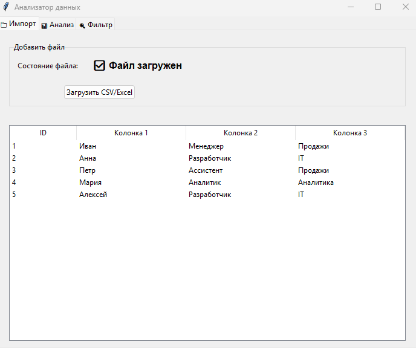
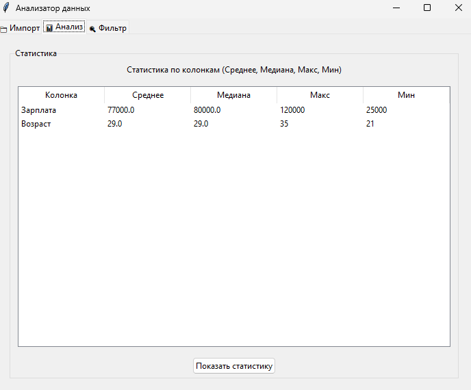
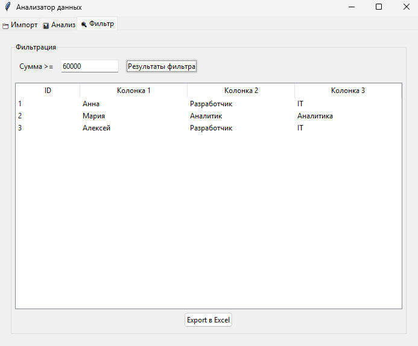

# 📊 Анализатор данных (Data Analyzer)

Десктопное приложение на Python для эффективной обработки табличных данных. Проект демонстрирует навыки работы с данными, фильтрами, статистикой и экспортом в Excel.

## 📸 Скриншоты





## 🚀 Функционал
- **Импорт:** Читает CSV и Excel файлы (конвейерная адаптация к различным разделителям).
- **Анализ:** Показывает статистику по числовым колонкам (Среднее, Медиана, Мин, Макс).
- **Фильтр:** Позволяет зафильтровать данные по заданному порогу.
- **Экспорт:** Выгружает данные в Excel (формат XLSX).

## 🛠️ Технологии
- Python 3.10+
- Tkinter (GUI)
- Pandas (Функции и анализ)
- Numpy (числовые секции)

## 📦 Установка и запуск
1. Склонируй репозиторий:
   ```bash
   git clone https://github.com/abc13666/data-analyzer.git
